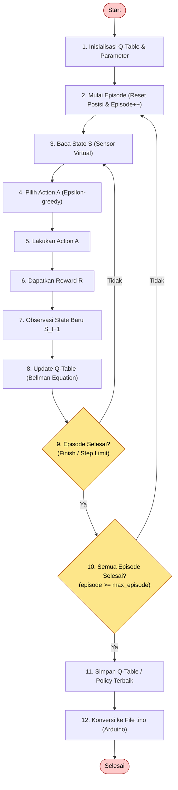
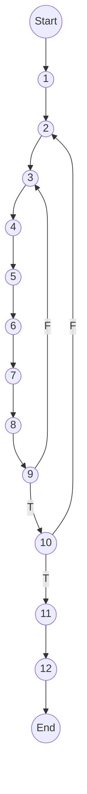

# Diagram Pengujian White Box Q-Learning (Sesuai Flowchart Bab 3)
# Render: https://mermaid.live atau plugin Mermaid di editor

## Gambar 4.4 — Flowchart Fungsi runEpisode / Training

## Gambar 4.5 — Control Flow Graph (CFG)

## Keterangan Node CFG & Kompleksitas

V(G) = P + 1 = 2 + 1 = **3**

2 node predikat: 9 (Episode Selesai?) dan 10 (Semua Episode Selesai?)

V(G) = E - N + 2 = 15 - 14 + 2 = **3**
(Edge = 15, Node = 14)
